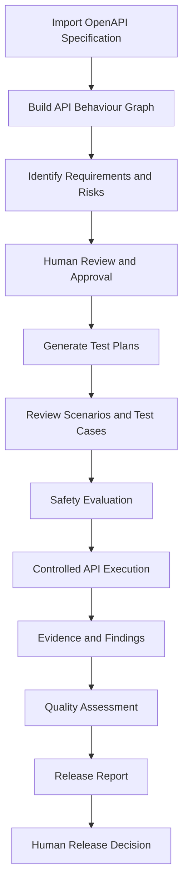

# TestPilot

M1.3 imports deterministic OpenAPI 3.0/3.1 knowledge. M1.4 builds immutable
deterministic Behaviour Graphs. M1.5 adds specification/graph-backed requirements
and risk proposals, provenance and append-only human review. See
[requirements/risk rules and security](docs/development/qa-intelligence.md),
[graph rules](docs/development/behaviour-graph.md) and
[API import](docs/development/api-knowledge.md).

M1.2/M1.3/M1.4/M1.5 migrations are deployed to Development Supabase per supplied
evidence. M1.6 migration deployment is confirmed by supplied evidence; hosted planning acceptance remains separate.
Hosted authenticated acceptance remains deferred. AI proposals have a validated
provider-independent contract; M1.12.3 adds an opt-in server-only OpenAI adapter. AI/LLM graph
inference and speculative graph generation do not exist. M1.7 introduces a local
safe execution foundation; its migration is deployed per supplied evidence, while hosted execution acceptance remains separate.

TestPilot is a planned AI-powered API quality and testing SaaS platform.
Give it your API to understand behavior, investigate risks and provide
evidence-backed release confidence.

**M1.6: deterministic test planning implemented and migration deployed; hosted planning acceptance remains separate.**
pnpm workspaces, strict TypeScript, ESLint, Prettier, Vitest and GitHub Actions CI
are configured. `apps/web` has Supabase SSR email/password authentication,
protected routes, persisted workspace onboarding and project selection. Domain
rules are provider independent; database operations use a dedicated adapter and
version-controlled RLS migrations. Projects create DEVELOPMENT, STAGING and
PRODUCTION environments atomically. M1.3–M1.5 add API knowledge, graphs and reviewable QA intelligence; the separate runner and opt-in real model adapter are implemented; hosted runtime acceptance remains separate.
Without Supabase configuration, auth pages explain setup and product access is
closed. No sample tenant data is displayed.

## Documentation map

- [Engineering constitution](AGENTS.md)
- Product: [vision](docs/product/vision.md), [principles](docs/product/principles.md),
  [user journey](docs/product/user-journey.md)
- Architecture: [overview](docs/architecture/overview.md),
  [data model](docs/architecture/data-model.md),
  [AI](docs/architecture/ai-architecture.md),
  [execution](docs/architecture/execution-engine.md),
  [security](docs/architecture/security.md)
- Development: [setup](docs/development/setup.md),
  [testing](docs/development/testing.md),
  [conventions](docs/development/conventions.md)
- ADRs: [monorepo](docs/adr/0001-monorepo-architecture.md),
  [graph storage](docs/adr/0002-postgresql-behaviour-graph.md),
  [runner](docs/adr/0003-separate-api-runner.md),
  [AI abstraction](docs/adr/0004-provider-independent-ai.md),
  [identity and context](docs/adr/0005-supabase-identity-and-tenant-context.md)

Directories separate `apps/web`, `workers/api-runner` and focused packages.
Domain, database, api-spec, behaviour-graph, qa-intelligence and ai implement M1.2–M1.5; test-engine implements deterministic planning/execution; safety, evidence and the separate runner implement M1.7. M1.8 derives findings outside runner authority; shared retains its foundation scope.
The web app composes domain-owned persistence operations through the database adapter.
Root `pnpm build` builds Next.js and verifies workspace compilation; other checks
and setup are documented in [setup](docs/development/setup.md).
CI exists in [.github/workflows/ci.yml](.github/workflows/ci.yml); it has no deployment.

Run `pnpm --filter @testpilot/web dev` and open http://127.0.0.1:3000.
Configure Supabase first using [setup](docs/development/setup.md). See
[testing](docs/development/testing.md) for real SQL policy tests and the remaining
live authentication/tenancy verification checklist.

M1.6 adds immutable, traceable Test Studio plans/scenarios/cases and independent human review. Its migration passed security re-preflight and was deployed by the user; hosted authenticated planning remains deferred. See [test planning](docs/development/test-planning.md).

M1.7 activates Runs, explicit environment targets and a separate deterministic
worker. Planning approval does not authorize HTTP; Safety and exact approval govern
execution. See [safe execution limits, worker setup and trust boundary](docs/development/safe-execution.md).

## M1.8 evidence and findings

Completed persisted results can be explicitly derived into immutable evidence
references and deterministic finding candidates from Runs. Findings supports
paginated observation history, requirement/risk references and attributed human
confirmation/dismissal. Repeated observations preserve prior review decisions.
Timeout/transport observations do not automatically establish API defects.
AI interpretation has a validated provider-neutral proposal contract only.
See [evidence and finding boundaries](docs/development/evidence-findings.md).
M1.8 Evidence + Findings is deployed: migration
`20261007000700_evidence_findings.sql` is applied to hosted Supabase, and local
and hosted migration histories are aligned through 00700. Final hosted M1.8
verification passed. Actual AI provider interpretation remains intentionally
deferred.

## M1.9 bounded curiosity

Investigations connects persisted observations to grounded follow-up proposals,
exact human review, bounded dependency/attempt budgets and existing M1.7 execution.
M1.8 owns resulting evidence/findings. Eligible HTTP status observations support
narrow numeric query bindings; redacted resource identifiers remain ineligible.
Bounded OpenAI hypotheses are opt-in in M1.12.3; live provider acceptance remains deferred. Migration
`20261007000800_curiosity_engine.sql` is deployed to hosted Supabase; local and hosted
migrations are aligned through 00800. M1.9 post-deployment verification passed.
M1.10 Evidence Memory + API Quality Intelligence is deployed; hosted verification passed and migration histories align through 00900. M1.11 Release Intelligence + Reports is implemented and deployed; hosted catalog/function verification passed and local/remote migrations align through 01000. See [curiosity boundaries](docs/development/curiosity-engine.md).

## M1.10 evidence memory and API quality

Memory now derives bounded provenance-linked observations; Overview and Quality
explain deterministic versioned scores, gaps, sufficiency and trends. Humans retain
finding and release authority. Migration
`20261007000900_memory_quality_intelligence.sql` is deployed and final hosted verification passed. See
[exact formulas, security and verification](docs/development/memory-quality-intelligence.md).

## M1.11 release intelligence and reports

Release Center now creates environment/source-scoped releases, derives deterministic immutable assessments, preserves explicit human decisions and generates immutable in-product/JSON reports. TestPilot assesses; humans decide. Migration `20261007001000_release_intelligence_reports.sql` is deployed; local/remote histories align through 01000 and hosted catalog/function verification passed with no blocking defects. Local concurrency tests passed; authenticated hosted browser acceptance and hosted concurrency behavior were not exercised. M1.12 hardening is in progress; 01100 is deployed and local/remote migrations align through 01100. No automatic release approval or deployment control is implemented. See [policy, authority, report snapshots and verification](docs/development/release-intelligence-reports.md).

## M1.12.1 deployment foundations

Deployment/configuration preparation is available in [the deployment runbook](docs/development/deployment.md). This is not a launch: M1.12.2 adds [leased runner recovery and operational health](docs/development/runner-operations.md), with additive migration 01100 deployed successfully. Hosted catalog/function verification passed on PostgreSQL 17.11; local/remote migrations align through 01100 and the runner retains five authorized RPCs. Hosted worker runtime and HTTP execution remain untested; Docker runtime and PostgreSQL 17 CI execution remain pending. Production launch has not occurred.

## M1.12.3 bounded OpenAI reasoning

Test Studio and Investigations support opt-in, server-only OpenAI Responses with
strict Structured Outputs. Suggestions remain unverified and require human review;
AI cannot authorize execution. Migrations `20261008001200_ai_reasoning.sql`, `20261008001300_ai_retry.sql`
and `20261009001400_bulk_review.sql` are deployed to Development per supplied
verification. Local/hosted histories align through 01400. Real AI-assisted
planning has succeeded in Development; this does not establish general hosted
acceptance or runner operation. Production launch has not occurred. See [configuration, budgets and
limitations](docs/development/openai-reasoning.md).

## Vercel beta preparation

See [Preview deployment checklist](docs/development/vercel-preview.md). API execution
defaults unavailable until the dedicated runner is configured and verified.

## Product overview

The following describes the intended connected workflow. Runtime execution remains
subject to the deployment and acceptance limitations documented above.

## Introducing TestPilot

**TestPilot is an AI-assisted, evidence-driven API quality assurance platform designed to help engineering teams understand, test, and evaluate their APIs.**

Traditional API testing often requires engineers to manually interpret specifications, identify risks, write test cases, execute requests, investigate failures, and prepare quality reports.

TestPilot brings these activities together into one connected QA workflow.

Instead of treating API testing as a collection of disconnected tasks, TestPilot connects specifications, requirements, risks, test cases, execution results, findings, and release decisions.

> **Our mission:** Make API quality assurance more intelligent, structured, traceable, and accessible without removing human judgment.

## The Problem We're Solving

API quality assurance can be challenging when teams face:

- Large and complex API specifications.
- Time-consuming test scenario creation.
- Requirements that are difficult to trace to tests.
- Limited visibility into API risks.
- Repetitive manual testing activities.
- Disconnected defect and execution records.
- Uncertainty about whether an API is ready for release.

**TestPilot aims to reduce this complexity through automation, AI-assisted reasoning, structured workflows, and evidence-backed quality assessments.**

## How TestPilot Works

### From specification to quality insight

**1. Import your API**

Upload an OpenAPI specification to establish the API's documented structure.

**2. Understand the API**

TestPilot creates an API Behaviour Graph that connects operations, schemas, parameters, responses, and security declarations.

**3. Identify what matters**

The platform derives requirements and risk signals from available specification evidence.

**4. Review and approve**

QA engineers review proposals before they become approved planning inputs.

**5. Build a test plan**

Generate test scenarios and cases connected to the approved requirements.

**6. Execute safely**

Execution requires separate safety evaluation and authorization. Approval of a test case alone does not authorize HTTP execution.

**7. Inspect evidence**

Review execution observations and investigate potential issues.

**8. Assess release confidence**

Evaluate the available quality evidence and support an informed human release decision.

## Platform Modules

| Module                   | Purpose                                            |
| ------------------------ | -------------------------------------------------- |
| **Overview**             | Project quality status and key insights            |
| **API Map**              | API specification exploration and Behaviour Graph  |
| **Requirements**         | Requirement proposals, traceability, and approvals |
| **Risks**                | Risk assessment and human review                   |
| **Test Studio**          | Test planning, scenarios, cases, and coverage      |
| **Runs**                 | Controlled API execution and results               |
| **Investigations**       | Evidence-driven investigation workflows            |
| **Findings**             | Potential defects and observed issues              |
| **Quality Intelligence** | Evidence-based quality assessment                  |
| **Release Center**       | Release preparation and human decisions            |
| **Reports**              | Structured quality and release reporting           |

## Safety by Design

TestPilot treats API execution as a controlled operation.

Its safety architecture is designed around:

| Principle                   | Description                                                 |
| --------------------------- | ----------------------------------------------------------- |
| **Human oversight**         | People retain approval and release authority                |
| **Policy-based execution**  | Execution is subject to explicit safety rules               |
| **Environment protection**  | Requests are evaluated against configured restrictions      |
| **Evidence-first findings** | Runtime claims require supporting observations              |
| **Traceability**            | Quality decisions can be linked to their sources            |
| **Tenant isolation**        | Workspace data access is governed by authorization policies |
| **Bounded AI reasoning**    | AI activity is subject to configuration and resource limits |

> TestPilot is not designed to let an AI agent freely send arbitrary HTTP requests to external systems.

## Our Vision

We envision a future where QA engineers spend less time on repetitive setup and disconnected documentation, and more time understanding risks, investigating complex behaviour, and improving software quality.

TestPilot is being built to support that future.

**Not to replace QA engineers — but to give them better tools, clearer evidence, and more confidence in their decisions.**

## License

Please refer to the repository's `LICENSE` file, if present.

Until a license is explicitly published, no open-source usage rights should be assumed.

---

### TestPilot

**Smarter testing. Stronger evidence. Better release decisions.**

Built with a focus on API quality, responsible AI, and human-centered engineering.

 

**Follow the project as TestPilot continues to evolve.**

