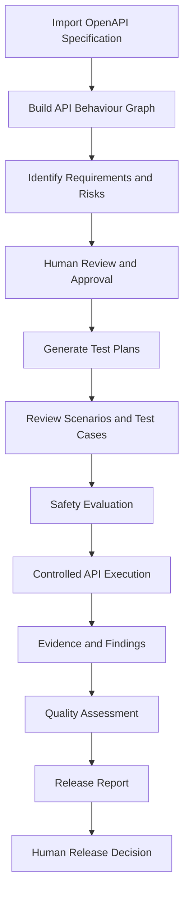
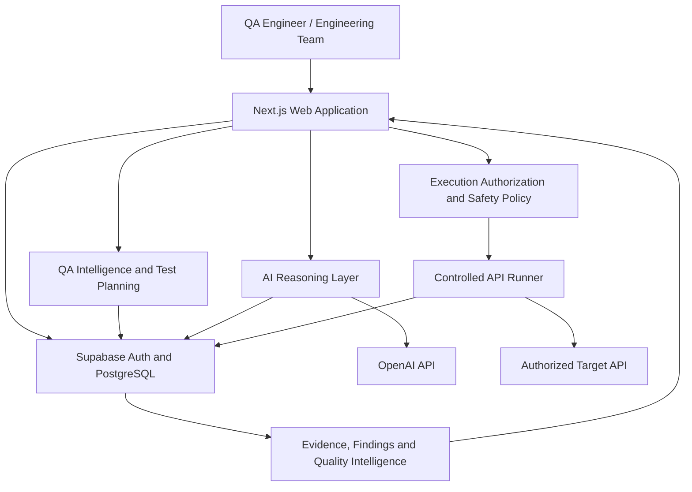

<div align="center">

# TestPilot

### AI-Powered API Quality Assurance Platform

**From API specification to release confidence.**

Turn API specifications into structured requirements, risk assessments, test plans, execution evidence, and informed release decisions.

<br/>


<br/>


</div>

---

##  Introducing TestPilot

**TestPilot is an AI-assisted, evidence-driven API quality assurance platform designed to help engineering teams understand, test, and evaluate their APIs.**

Traditional API testing often requires engineers to manually interpret specifications, identify risks, write test cases, execute requests, investigate failures, and prepare quality reports.

TestPilot brings these activities together into one connected QA workflow.

Instead of treating API testing as a collection of disconnected tasks, TestPilot connects specifications, requirements, risks, test cases, execution results, findings, and release decisions.

> **Our mission:** Make API quality assurance more intelligent, structured, traceable, and accessible without removing human judgment.

---

##  The Problem We're Solving

API quality assurance can be challenging when teams face:

- Large and complex API specifications.
- Time-consuming test scenario creation.
- Requirements that are difficult to trace to tests.
- Limited visibility into API risks.
- Repetitive manual testing activities.
- Disconnected defect and execution records.
- Uncertainty about whether an API is ready for release.

**TestPilot aims to reduce this complexity through automation, AI-assisted reasoning, structured workflows, and evidence-backed quality assessments.**

---

##  What TestPilot Can Do

<table>
<tr>
<td width="50%" valign="top">

###  API Map

Import OpenAPI specifications and explore API operations, schemas, security declarations, and relationships through an interactive Behaviour Graph.

</td>
<td width="50%" valign="top">

###  Requirements Intelligence

Derive specification-backed requirements, inspect their evidence, and approve, revise, or reject proposals through human review.

</td>
</tr>
<tr>
<td valign="top">

###  Risk Intelligence

Identify potential API testing risks, review severity and traceability, and create additional human-authored risks.

</td>
<td valign="top">

###  Test Studio

Generate structured test plans, scenarios, and test cases from approved requirements, with coverage and traceability views.

</td>
</tr>
<tr>
<td valign="top">

###  Controlled API Execution

Use a policy-governed execution workflow designed to protect environments and restrict unsafe requests.

</td>
<td valign="top">

###  Findings & Investigations

Connect observed behaviour to execution evidence, investigate suspicious results, and maintain reviewable findings.

</td>
</tr>
<tr>
<td valign="top">

###  Quality Intelligence

Evaluate API quality using available evidence, risk information, execution results, and freshness signals.

</td>
<td valign="top">

###  Release Intelligence

Support release reviews with structured quality information, reports, and explicit human decisions.

</td>
</tr>
</table>

---

##  How TestPilot Works



### From specification to quality insight

**1. Import your API**

Upload an OpenAPI specification to establish the API's documented structure.

**2. Understand the API**

TestPilot creates an API Behaviour Graph that connects operations, schemas, parameters, responses, and security declarations.

**3. Identify what matters**

The platform derives requirements and risk signals from available specification evidence.

**4. Review and approve**

QA engineers review proposals before they become approved planning inputs.

**5. Build a test plan**

Generate test scenarios and cases connected to the approved requirements.

**6. Execute safely**

Execution requires separate safety evaluation and authorization. Approval of a test case alone does not authorize HTTP execution.

**7. Inspect evidence**

Review execution observations and investigate potential issues.

**8. Assess release confidence**

Evaluate the available quality evidence and support an informed human release decision.

---

##  Platform Modules

| Module | Purpose |
|---|---|
| **Overview** | Project quality status and key insights |
| **API Map** | API specification exploration and Behaviour Graph |
| **Requirements** | Requirement proposals, traceability, and approvals |
| **Risks** | Risk assessment and human review |
| **Test Studio** | Test planning, scenarios, cases, and coverage |
| **Runs** | Controlled API execution and results |
| **Investigations** | Evidence-driven investigation workflows |
| **Findings** | Potential defects and observed issues |
| **Quality Intelligence** | Evidence-based quality assessment |
| **Release Center** | Release preparation and human decisions |
| **Reports** | Structured quality and release reporting |

---

##  Product Preview

TestPilot is undergoing active UI/UX improvements.

The platform includes an interactive API Map, requirements and risk review workflows, and a Test Studio for planning and traceability.

**Screenshots of the redesigned interface will be added as the visual experience is finalized.**

---

##  AI-Assisted Quality Assurance

TestPilot is designed to use AI as a reasoning assistant, not an unrestricted automation engine.

AI-assisted capabilities are intended to help with:

- Proposing additional test objectives.
- Identifying potential testing gaps.
- Supporting risk-aware test planning.
- Investigating evidence and suspicious behaviour.
- Reducing repetitive analysis work.

AI functionality depends on server configuration, supported models, and available provider credits.

### Our AI philosophy

<div align="center">

### AI reasons. Policy authorizes. Code executes. Evidence proves. Humans control.

</div>

AI-generated proposals require appropriate review.

AI does not independently authorize API execution or approve a release.

---

##  Safety by Design

TestPilot treats API execution as a controlled operation.

Its safety architecture is designed around:

| Principle | Description |
|---|---|
| **Human oversight** | People retain approval and release authority |
| **Policy-based execution** | Execution is subject to explicit safety rules |
| **Environment protection** | Requests are evaluated against configured restrictions |
| **Evidence-first findings** | Runtime claims require supporting observations |
| **Traceability** | Quality decisions can be linked to their sources |
| **Tenant isolation** | Workspace data access is governed by authorization policies |
| **Bounded AI reasoning** | AI activity is subject to configuration and resource limits |

> TestPilot is not designed to let an AI agent freely send arbitrary HTTP requests to external systems.

---

##  Technology Stack

<div align="center">

### Frontend


&nbsp;&nbsp;

&nbsp;&nbsp;

&nbsp;&nbsp;


<br/>

**Next.js · React · TypeScript · Tailwind CSS**

### Backend & Database


&nbsp;&nbsp;

&nbsp;&nbsp;


<br/>

**Supabase · PostgreSQL · Node.js**

### AI & Infrastructure


&nbsp;&nbsp;

&nbsp;&nbsp;


<br/>

**OpenAI API · Docker · Vercel**

### Development Tools


&nbsp;&nbsp;

&nbsp;&nbsp;


<br/>

**Git · GitHub · VS Code · pnpm**

</div>

---

##  System Architecture

TestPilot uses a modular architecture separating the user interface, quality intelligence, persistent data, AI reasoning, and controlled execution.



### Architectural principles

- Modular application and domain packages.
- Workspace-scoped access control.
- Server-side AI integration.
- Strict separation between AI reasoning and HTTP execution.
- Persistent provenance and review records.
- Evidence-backed quality assessment.
- Human-controlled release decisions.

---

##  Project Structure

TestPilot uses a pnpm monorepo organized around applications, shared packages, database infrastructure, and documentation.

```text
TestPilot/
├── apps/
│   └── web/                 # Next.js application
│
├── packages/                # Shared domain and QA packages
│
├── supabase/                # Database migrations and policies
│
├── docs/                    # Technical documentation
│
├── pnpm-workspace.yaml      # Workspace configuration
│
└── README.md
```

The structure may evolve as development continues.

---

##  Getting Started

### Prerequisites

Before running TestPilot locally, ensure you have:

- Node.js 24 or a compatible version supported by the repository.
- pnpm.
- Git.
- A configured Supabase project.
- The environment variables required by the application.

### 1. Clone the repository

```bash
git clone https://github.com/YOUR-USERNAME/TestPilot.git
cd TestPilot
```

Replace `YOUR-USERNAME` with the actual GitHub account or organization hosting the repository.

### 2. Install dependencies

```bash
pnpm install
```

### 3. Configure environment variables

Create the appropriate local environment file for the web application, following the repository's environment examples and setup documentation.

For AI integration, the server-side configuration includes:

```dotenv
OPENAI_API_KEY=your_openai_api_key
OPENAI_MODEL=gpt-4.1-mini
OPENAI_AI_ENABLED=false
```

Additional Supabase, authentication, and runner configuration is required for the corresponding features.

**Never commit real API keys or other secrets to GitHub.**

### 4. Start the development server

```bash
pnpm --dir apps/web dev
```

Open:

```text
http://localhost:3000
```

### 5. Explore the platform

Once authenticated, create or select a workspace and project, then import an OpenAPI specification.

You can begin exploring the API Map, requirements, risks, and standard test planning without enabling paid AI requests.

---

##  Testing & Validation

TestPilot includes automated tests covering its domain logic, user interface components, authorization-sensitive workflows, and QA planning functionality.

Development validation includes:

- Unit tests.
- Regression tests.
- TypeScript type checking.
- Linting and formatting checks.
- Production web builds.
- Database migration and policy validation.
- Manual browser acceptance testing.

A successful local test run does not automatically establish production readiness. Runtime integration and deployment checks are tracked separately.

---

##  Development Status

**TestPilot is currently under active development.**

| Capability | Status |
|---|---|
| OpenAPI import | Implemented |
| API Behaviour Graph | Implemented |
| Requirements intelligence | Implemented |
| Risk intelligence | Implemented |
| Human review workflows | Implemented |
| Standard test planning | Implemented |
| Test case traceability | Implemented |
| Controlled execution foundation | Implemented |
| Evidence and findings workflows | Implemented |
| Quality intelligence foundation | Implemented |
| Release intelligence foundation | Implemented |
| OpenAI integration | Implemented, controlled live acceptance pending |
| AI-assisted planning | Configuration-dependent |
| Full production readiness | Not yet established |
| Conversational AI assistant | Future product direction |

Some features have passed automated and manual acceptance tests, while others still require integration, operational, or deployment verification.

---

##  Roadmap

### Phase 1 — Core QA Intelligence

- [x] OpenAPI specification import.
- [x] API Behaviour Graph.
- [x] Requirement generation and review.
- [x] Risk identification and review.
- [x] Standard test planning.
- [x] Traceability and coverage views.

### Phase 2 — Execution & Evidence

- [x] Controlled execution architecture.
- [x] Evidence and findings foundation.
- [x] Investigation workflows.
- [ ] Complete end-to-end hosted execution acceptance.
- [ ] Expand real-world API integration testing.

### Phase 3 — AI-Assisted QA

- [x] Server-side OpenAI integration.
- [x] Structured AI reasoning safeguards.
- [ ] Complete controlled live AI acceptance.
- [ ] Improve AI-assisted test generation.
- [ ] Develop a conversational QA assistant experience.

### Phase 4 — Product Experience & Readiness

- [ ] Complete platform-wide UI/UX refinement.
- [ ] Expand accessibility and usability testing.
- [ ] Complete deployment and operational validation.
- [ ] Expand team collaboration and reporting capabilities.

---

##  Our Vision

We envision a future where QA engineers spend less time on repetitive setup and disconnected documentation, and more time understanding risks, investigating complex behaviour, and improving software quality.

TestPilot is being built to support that future.

**Not to replace QA engineers — but to give them better tools, clearer evidence, and more confidence in their decisions.**

---

##  Contributing

TestPilot is currently being developed as an evolving project.

Contribution guidelines and external contribution availability will be published when the project is ready for broader collaboration.

---

##  License

Please refer to the repository's `LICENSE` file, if present.

Until a license is explicitly published, no open-source usage rights should be assumed.

---

<div align="center">

###  TestPilot

**Smarter testing. Stronger evidence. Better release decisions.**

Built with a focus on API quality, responsible AI, and human-centered engineering.

<br/>

 **Follow the project as TestPilot continues to evolve.**

</div>
